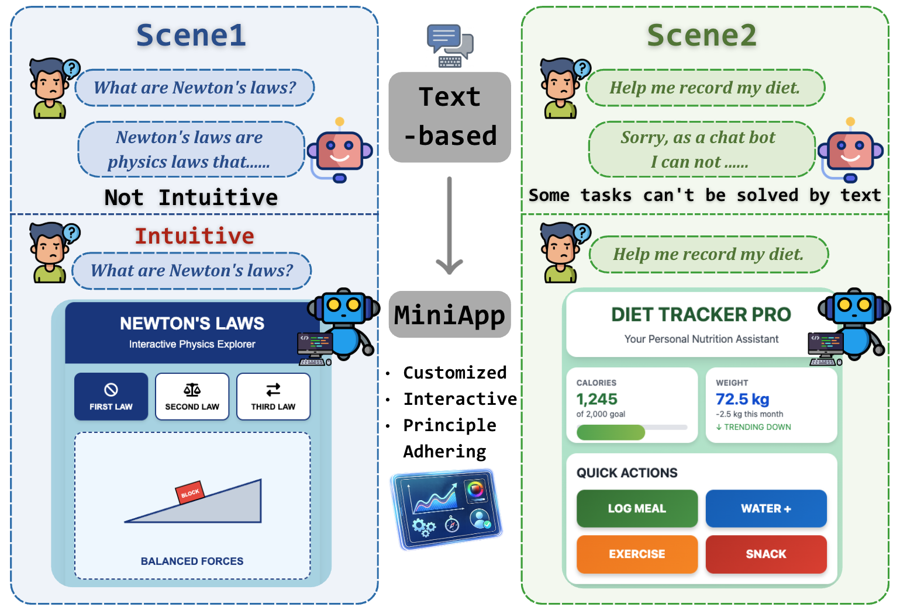
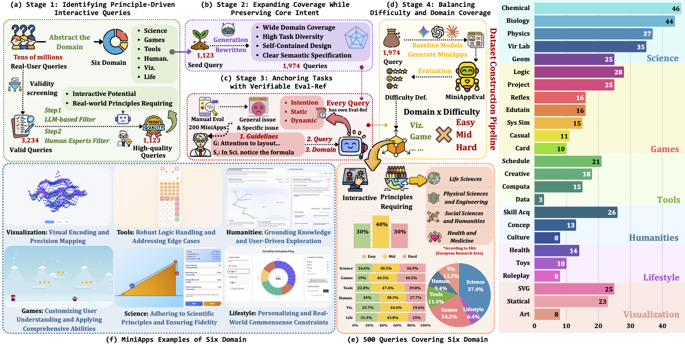

<link rel="preconnect" href="https://fonts.googleapis.com">
<link rel="preconnect" href="https://fonts.gstatic.com" crossorigin>
<link href="https://fonts.googleapis.com/css2?family=Inter:wght@400;500;600&family=Merriweather:ital,wght@0,400;0,700;1,400&family=JetBrains+Mono:wght@400;500&display=swap" rel="stylesheet">

<style>
  /*111  */
  .paper-meta{
  text-align:center;
  margin: 2rem 0 2.5rem;
  color: var(--color-text-muted);
}

.paper-authors{
  display:flex;
  flex-wrap:wrap;
  justify-content:center;
  gap: .3rem .5rem;              /* 行间距/列间距 */
  font-size: 1.25rem;
  line-height: 1.6;
}

.paper-authors .author{
  white-space: nowrap;
}

.paper-authors .author:not(:last-child)::after{
  content: " ·";
  margin-left: .25rem;
  color: #9aa0a6;
}

.paper-institutions{
  display:flex;
  flex-wrap:wrap;
  justify-content:center;
  gap: .35rem 2rem;
  margin-top: .55rem;
  font-size: 1.05rem;
  line-height: 1.6;
}

.paper-institutions .inst{
  white-space: nowrap;
}

.paper-notes{
  display:flex;
  flex-wrap:wrap;
  justify-content:center;
  gap: .35rem 2rem;
  margin-top: .55rem;
  font-size: .95rem;
  line-height: 1.6;
}

  /*111  */
  :root {
    --color-text: #222222;
    --color-text-muted: #555555;
    --color-heading: #111111;
    --color-link: #0056b3;
    --color-link-hover: #003d82;
    --color-border: #dddddd;
    --color-bg-light: #f8f9fa;
  }

  body {
    font-family: 'Inter', -apple-system, BlinkMacSystemFont, "Segoe UI", Roboto, sans-serif;
    color: var(--color-text);
    font-size: 18px;
    line-height: 1.75;
    max-width: 950px;
    margin: 0 auto;
    padding: 20px 40px 70px;
    background-color: #ffffff;
  }

  /* Academic Typography */
  h1, h2, h3, h4 {
    font-family: 'Merriweather', serif;
    color: var(--color-heading);
    line-height: 1.3;
  }

  h2 { font-size: 2.2rem; font-weight: 700; margin-top: 4rem; margin-bottom: 1.8rem; border-bottom: 2px solid var(--color-border); padding-bottom: 0.6rem; }
  h3 { font-size: 1.7rem; font-weight: 700; margin-top: 3rem; margin-bottom: 1.4rem; }
  p { margin-bottom: 1.4rem; }
  ul { margin: 1.3rem 0; padding-left: 2.5rem; }
  li { margin-bottom: 0.9rem; line-height: 1.75; }
  ol { margin: 1.3rem 0; padding-left: 2.5rem; }
  ol li { margin-bottom: 0.9rem; line-height: 1.75; }
  strong { font-weight: 600; }
  a { color: var(--color-link); text-decoration: none; }
  a:hover { color: var(--color-link-hover); text-decoration: underline; }

  /* Title Section Styling */
  .main-title { font-size: 3.8rem; font-weight: 700; text-align: center; margin: 2rem 0 1rem; font-family: 'Merriweather', serif; color: var(--color-heading); line-height: 1.2; }
  .main-subtitle { font-size: 1.5rem; color: var(--color-text-muted); font-weight: 400; margin: 1rem auto 2rem; text-align: center; max-width: 850px; line-height: 1.6; }
  .paper-authors { font-size: 1.25rem; margin: 2rem 0 2.5rem; text-align: center; color: var(--color-text-muted); }

  /* Abstract Block */
  .abstract-block { background-color: var(--color-bg-light); padding: 3rem 3.5rem; border-radius: 8px; margin: 3.5rem 0; }
  .abstract-block h2 { text-align: center; border: none; margin-top: 0; margin-bottom: 2rem; font-size: 2rem; }
  .abstract-block p { font-size: 1.05rem; }

  /* Academic Notice / Callout */
  .update-notice { background-color: #f1f8ff; border-left: 5px solid var(--color-link); padding: 2.5rem 3rem; margin: 3rem auto; border-radius: 5px; max-width: 850px; }
  .update-notice h3 { margin-top: 0; margin-bottom: 1rem; color: var(--color-link); font-family: 'Inter', sans-serif; font-size: 1.15rem; text-transform: uppercase; letter-spacing: 0.05em; }
  .update-notice p { font-size: 1.05rem; }

  /* CTA Button */
  .primary-cta { display: inline-block; background: var(--color-link); color: white !important; padding: 1rem 2.5rem; border-radius: 6px; font-weight: 500; font-size: 1.1rem; text-decoration: none; transition: all 0.2s; }
  .primary-cta:hover { background: var(--color-link-hover); text-decoration: none; transform: translateY(-1px); }

  /* Badges */
  .badge-row { display: flex; gap: 1rem; justify-content: center; flex-wrap: wrap; margin: 2.5rem 0; }
  .badge-row img { height: 32px; }

  /* Figures */
  figure { margin: 4rem 0; text-align: center; }
  figure img { max-width: 100%; border-radius: 8px; border: 1px solid var(--color-border); box-shadow: 0 2px 8px rgba(0,0,0,0.06); }
  figcaption { font-size: 1rem; color: var(--color-text-muted); margin-top: 1.5rem; line-height: 1.6; max-width: 800px; margin-left: auto; margin-right: auto; }

  /* Code Blocks */
  code { font-family: 'JetBrains Mono', monospace; font-size: 0.9em; background: var(--color-bg-light); padding: 0.25em 0.5em; border-radius: 4px; border: 1px solid var(--color-border); color: #d73a49; }
  pre { background: var(--color-bg-light); padding: 2rem; border-radius: 8px; border: 1px solid var(--color-border); overflow-x: auto; margin: 2.5rem 0; }
  pre code { background: transparent; padding: 0; border: none; color: inherit; font-size: 0.95em; }

  .table-container { overflow-x: auto; margin: 3.5rem 0; }

  .markdown-body table.academic-table,
  table.academic-table {
    width: 100% !important;
    border-collapse: collapse !important;
    font-size: 0.95rem !important;
    font-family: 'Inter', sans-serif !important;
    border: none !important;
    background-color: transparent !important;
    margin: 0 !important;
  }

  .markdown-body table.academic-table tr,
  .markdown-body table.academic-table tr:nth-child(2n),
  table.academic-table tr,
  table.academic-table tr:nth-child(2n) {
    background-color: transparent !important;
    border: none !important;
  }

  .markdown-body table.academic-table th,
  .markdown-body table.academic-table td,
  table.academic-table th,
  table.academic-table td {
    border: none !important;
    padding: 14px 16px !important;
    text-align: center !important;
    vertical-align: middle !important;
    color: var(--color-text) !important;
    background-color: transparent !important;
  }

  table.academic-table thead {
    border-top: 2px solid #111 !important;
    border-bottom: 1px solid #111 !important;
  }
  table.academic-table tbody {
    border-bottom: 2px solid #111 !important;
  }

  table.academic-table th:first-child,
  table.academic-table td:first-child { text-align: left !important; }

  table.academic-table tr.table-section-header td {
    font-style: italic !important;
    background-color: #f8f9fa !important;
    border-top: 1px dashed #ddd !important;
    border-bottom: 1px dashed #ddd !important;
    color: #555 !important;
    text-align: center !important;
  }

  table.academic-table tr.average-row td {
    border-top: 1px solid #111 !important;
    background-color: #fcfcfc !important;
    font-weight: 600 !important;
  }

  /* Responsive Design */
  @media (max-width: 768px) {
    body { padding: 20px 25px 40px; font-size: 16px; }
    .main-title { font-size: 2.5rem; }
    .main-subtitle { font-size: 1.2rem; }
    h2 { font-size: 1.8rem; }
    h3 { font-size: 1.4rem; }
    .abstract-block { padding: 2rem 1.5rem; }
    .update-notice { padding: 2rem 1.5rem; }
    .badge-row img { height: 28px; }
  }
</style>

<h1 class="main-title">MiniAppBench</h1>
<p class="main-subtitle">Evaluating the Shift from Text to Interactive HTML Responses <br> in LLM-Powered Assistants</p>

<!-- <p class="paper-authors" style="line-height: 1.8;">
  Zuhao Zhang<sup>1,2*</sup> &nbsp;·&nbsp;
  Chengyue Yu<sup>1*</sup> &nbsp;·&nbsp;
  Yuante Li<sup>3</sup> &nbsp;·&nbsp;
  Chenyi Zhuang<sup>1†</sup> &nbsp;·&nbsp;
  Linjian Mo<sup>1</sup> &nbsp;·&nbsp;
  Shuai Li<sup>2</sup>
</p>

<p class="paper-institutions" style="font-size: 1.05rem; color: var(--color-text-muted); margin-bottom: 0.5rem;">
  <sup>1</sup>Inclusion AI, Ant Group &nbsp;&nbsp;&nbsp;
  <sup>2</sup>Shanghai Jiao Tong University &nbsp;&nbsp;&nbsp;
  <sup>3</sup>Carnegie Mellon University
</p>

<p class="paper-notes" style="font-size: 0.9rem; color: var(--color-text-muted); margin-bottom: 2rem;">
  <sup>*</sup>Equal Contribution &nbsp;&nbsp;&nbsp; <sup>†</sup>Corresponding Author
</p>> -->

<div class="paper-meta">
  <div class="paper-authors">
    <span class="author">Zuhao Zhang<sup>1,2*</sup></span>
    <span class="author">Chengyue Yu<sup>1*</sup></span>
    <span class="author">Yuante Li<sup>3</sup></span>
    <span class="author">Chenyi Zhuang<sup>1†</sup></span>
    <span class="author">Linjian Mo<sup>1</sup></span>
    <span class="author">Shuai Li<sup>2</sup></span>
  </div>

  <div class="paper-institutions">
    <span class="inst"><sup>1</sup>Inclusion AI, Ant Group</span>
    <span class="inst"><sup>2</sup>Shanghai Jiao Tong University</span>
    <span class="inst"><sup>3</sup>Carnegie Mellon University</span>
  </div>

  <div class="paper-notes">
    <span class="note"><sup>*</sup>Equal Contribution</span>
    <span class="note"><sup>†</sup>Corresponding Author</span>
  </div>
</div>


<div class="badge-row">
 <!-- <a href="https://arxiv.org/abs/2603.09652"></a>
  <a href="https://huggingface.co/spaces/MiniAppBench/Leaderboard"></a>
  <a href="https://github.com/MiniAppBench/miniappbench.git"></a>
  <a href="https://huggingface.co/datasets/MiniAppBench/Dataset"></a> -->
    <a href="https://arxiv.org/abs/2603.09652">
    
  </a>

  <a href="https://huggingface.co/spaces/MiniAppBench/Leaderboard">
    
  </a>

  <a href="https://github.com/MiniAppBench/miniappbench">
    
  </a>

  <a href="https://huggingface.co/datasets/MiniAppBench/Dataset">
    
  </a>
</div>

<div class="update-notice">
  <h3>📢 Latest Update — February 28, 2026</h3>
  <p><strong>Interactive Leaderboard Now Available!</strong> Test your models on MiniAppBench by submitting to our leaderboard. Simply provide your LLM API endpoint and let our evaluation framework automatically assess performance across 500 real-world tasks.</p>
  <div style="margin-top: 1.8rem;">
    <a href="https://huggingface.co/spaces/MiniAppBench/Leaderboard" class="primary-cta">Submit to Leaderboard →</a>
  </div>
</div>

<div class="abstract-block">
  <h2>Abstract</h2>
  <p><strong>Human-AI interaction is evolving from static text responses to dynamic, interactive applications.</strong></p>
  <p><strong>MiniAppBench</strong> is the first comprehensive benchmark designed to evaluate <strong>principle-driven, interactive application generation</strong>. While traditional benchmarks focus on static layouts or algorithmic snippets, MiniAppBench shifts the paradigm toward <strong>MiniApps</strong>—HTML-based applications that require both visual rendering and complex interaction logic.</p>

  <h3 style="font-size: 1.2rem; margin-top: 2rem;">Key Highlights:</h3>
  <ul style="margin-top: 0.8rem; padding-left: 2rem;">
    <li>🌍 <strong>Real-World Scale:</strong> Distilled from 10M+ generations</li>
    <li>📊 <strong>Diverse Tasks:</strong> 500 tasks across 6 domains</li>
    <li>🤖 <strong>MiniAppEval Framework:</strong> Agentic browser automation</li>
    <li>📏 <strong>Multi-Dimensional:</strong> Intention, Static, Dynamic scoring</li>
    <li>🔬 <strong>High Alignment:</strong> Pearson r > 0.85 with humans</li>
  </ul>
</div>

<figure>
  
  <figcaption><strong>Figure 1.</strong> The shift from text to MINIAPPS. Unlike static text, MINIAPPS transforms abstract explanations into intuitive visualizations and unlocks actionable tasks (e.g., diet tracking) that were previously impossible.</figcaption>
</figure>

---

## Benchmark Construction and Statistics

<figure>
  
  <figcaption><strong>Figure 2.</strong> MiniAppBench data construction pipeline from production application (10M+ generations) to curated evaluation benchmark.</figcaption>
</figure>

### Task Distribution by Domain

<div class="table-container">
  <table class="academic-table">
    <thead>
      <tr>
        <th>Domain</th>
        <th>Tasks</th>
        <th>Description</th>
      </tr>
    </thead>
    <tbody>
      <tr>
        <td><strong>🔬 Science</strong></td>
        <td>187</td>
        <td>Simulators and virtual laboratories for chemistry, biology, physics, and geometry</td>
      </tr>
      <tr>
        <td><strong>🎮 Games</strong></td>
        <td>121</td>
        <td>Logic puzzles, projectile motion games, systemic simulations, and casual/card games</td>
      </tr>
      <tr>
        <td><strong>🛠️ Tools</strong></td>
        <td>57</td>
        <td>Practical utilities including schedulers, creative editors, and computational tools</td>
      </tr>
      <tr>
        <td><strong>📊 Visualization</strong></td>
        <td>56</td>
        <td>SVG-based graphics, statistical charts, and interactive generative art</td>
      </tr>
      <tr>
        <td><strong>📚 Humanities</strong></td>
        <td>47</td>
        <td>Interactive platforms for skill acquisition, concept deconstruction, and cultural study</td>
      </tr>
      <tr>
        <td><strong>💚 Lifestyle</strong></td>
        <td>32</td>
        <td>Health and wellness trackers, interactive toys, and roleplay-based applications</td>
      </tr>
      <tr class="average-row">
        <td>Total</td>
        <td>500</td>
        <td>Comprehensive coverage of interactive application scenarios</td>
      </tr>
    </tbody>
  </table>
</div>

---

## Methodology: MiniAppEval

Unlike benchmarks with a single "ground truth," **MiniAppEval** addresses the open-ended nature of interactive applications through an **Agentic Framework** (powered by Gemini 3 Pro) that processes **four core inputs**: (i) the **user query $q_i$**, (ii) a structured **evaluation reference $r_i$**, (iii) the **generated source code**, and (iv) a **live, interactable MiniApp instance**.

1. **Exploration:** An LLM-based agent interacts with the live MiniApp in a browser (clicking, dragging, typing).
2. **Observation:** The system captures a comprehensive **interaction trajectory**, recording DOM states, console logs, and the underlying source code, providing the raw evidence required for deep analysis.
3. **Grading:** The agent scores the MiniApp based on the collected evidence. The evaluation reference $r_i$ informs the inspection strategy but does not serve as a rigid oracle.
   - **Intention Alignment:** Verifies if the MiniApp fulfills the high-level user goal.
   - **Static Quality:** Evaluates structural and syntactic correctness without execution.
   - **Dynamic Logic:** Assesses runtime behavior through trajectories, focusing on **Sequential Logic** and **Robustness**.

---

## Experimental Results

We evaluated **15 state-of-the-art LLMs** across 500 tasks, measuring pass rates by difficulty, domain, and overall performance.

### Performance Leaderboard

<div class="table-container">
  <table class="academic-table">
    <thead>
      <tr>
        <th>Model</th>
        <th><strong>Avg (%)</strong></th>
        <th>Easy</th>
        <th>Mid</th>
        <th>Hard</th>
        <th>Games</th>
        <th>Science</th>
        <th>Tools</th>
        <th>Humanities</th>
        <th>Viz</th>
        <th>Lifestyle</th>
      </tr>
    </thead>
    <tbody>
      <tr class="table-section-header">
        <td colspan="11">Open-Source Large Language Models</td>
      </tr>
      <tr><td>Qwen3-32B</td><td>0.66</td><td>1.59</td><td>0.55</td><td>0.00</td><td>0.00</td><td>0.57</td><td>0.00</td><td>0.00</td><td>2.04</td><td>3.70</td></tr>
      <tr><td>Qwen3-235B-A22B</td><td>2.88</td><td>6.43</td><td>2.35</td><td>0.00</td><td>0.93</td><td>0.60</td><td>4.00</td><td>4.88</td><td>7.27</td><td>10.34</td></tr>
      <tr><td>Qwen3-Coder-480B</td><td>1.83</td><td>6.06</td><td>0.00</td><td>0.00</td><td>0.00</td><td>0.00</td><td>0.00</td><td>0.00</td><td>9.43</td><td>11.11</td></tr>
      <tr><td>Kimi-K2-Instruct</td><td>6.19</td><td>14.17</td><td>5.03</td><td>0.00</td><td>3.77</td><td>3.11</td><td>4.08</td><td>4.88</td><td>17.65</td><td>18.52</td></tr>
      <tr><td>GLM-4.5-Air</td><td>7.09</td><td>17.60</td><td>4.07</td><td>1.44</td><td>5.66</td><td>4.27</td><td>6.98</td><td>7.32</td><td>16.98</td><td>10.34</td></tr>
      <tr><td>GLM-4.7</td><td>18.31</td><td>36.30</td><td>15.06</td><td>4.41</td><td>12.50</td><td>10.49</td><td>20.00</td><td>17.07</td><td>35.19</td><td>48.39</td></tr>
      <tr><td><strong>GLM-5</strong></td><td><strong>61.80</strong></td><td><strong>68.71</strong></td><td><strong>68.88</strong></td><td><strong>46.50</strong></td><td><strong>57.85</strong></td><td><strong>57.22</strong></td><td><strong>64.91</strong></td><td><strong>55.32</strong></td><td><strong>76.79</strong></td><td><strong>81.25</strong></td></tr>


      <tr class="table-section-header">
        <td colspan="11">Closed-Source Large Language Models</td>
      </tr>
      <tr><td>Hunyuan-Turbos</td><td>2.32</td><td>6.32</td><td>0.87</td><td>0.00</td><td>0.00</td><td>0.00</td><td>3.03</td><td>0.00</td><td>13.51</td><td>3.57</td></tr>
      <tr><td>Mimo-V2-Flash</td><td>12.48</td><td>28.68</td><td>8.33</td><td>2.22</td><td>13.46</td><td>6.02</td><td>10.87</td><td>11.63</td><td>23.53</td><td>36.36</td></tr>
      <tr><td>Grok-4.1-Reasoning</td><td>13.77</td><td>29.66</td><td>12.12</td><td>2.19</td><td>8.41</td><td>6.58</td><td>20.00</td><td>17.50</td><td>32.65</td><td>25.93</td></tr>
      <tr><td>MiniMax-M2.1</td><td>17.12</td><td>31.46</td><td>15.62</td><td>7.08</td><td>16.25</td><td>12.50</td><td>23.33</td><td>20.00</td><td>27.27</td><td>19.23</td></tr>
      <tr><td>Gemini-3-Flash</td><td>17.62</td><td>32.76</td><td>16.89</td><td>4.10</td><td>14.95</td><td>10.60</td><td>17.95</td><td>18.18</td><td>30.61</td><td>41.38</td></tr>
      <tr><td>Gemini-3-Pro</td><td>27.52</td><td>61.98</td><td>20.83</td><td>1.71</td><td>26.74</td><td>19.11</td><td>13.64</td><td>28.57</td><td>52.00</td><td>55.56</td></tr>
      <tr><td>GPT-5.1</td><td>32.00</td><td>74.71</td><td>21.37</td><td>3.49</td><td>24.14</td><td>18.10</td><td>33.33</td><td>45.83</td><td>57.78</td><td>64.71</td></tr>
      <tr><td>GPT-5.2</td><td>45.46</td><td>69.77</td><td>43.08</td><td>18.64</td><td>40.32</td><td>50.38</td><td>50.17</td><td>45.45</td><td>75.00</td><td>82.35</td></tr>
      <tr><td>GPT-5.3-Codex</td><td>36.20</td><td>56.46</td><td>38.27</td><td>14.65</td><td>37.19</td><td>22.46</td><td>54.39</td><td>29.79</td><td>55.36</td><td>56.25</td></tr>
      <tr><td>GPT-5.4</td><td>56.60</td><td>82.31</td><td>54.08</td><td>35.03</td><td>56.20</td><td>50.80</td><td>57.89</td><td>53.19</td><td>66.07</td><td>75.00</td></tr>
      <tr><td>Claude-Sonnet-4.5</td><td>26.36</td><td>68.22</td><td>14.86</td><td>1.79</td><td>16.13</td><td>22.30</td><td>29.27</td><td>23.81</td><td>47.73</td><td>44.83</td></tr>
      <tr><td>Claude-Opus-4.5</td><td>41.14</td><td>59.09</td><td>41.18</td><td>22.33</td><td>37.18</td><td>34.59</td><td>47.50</td><td>35.71</td><td>57.45</td><td>56.52</td></tr>
      <tr><td><strong>Claude-Opus-4.6</strong></td><td><strong>61.60</strong></td><td><strong>76.19</strong></td><td><strong>64.29</strong></td><td><strong>44.59</strong></td><td><strong>56.20</strong></td><td><strong>58.29</strong></td><td><strong>63.16</strong></td><td><strong>59.57</strong></td><td><strong>73.21</strong></td><td><strong>81.25</strong></td></tr>
      <tr class="average-row">
        <td>Average</td><td>28.58</td><td>43.88</td><td>27.25</td><td>12.79</td><td>22.11</td><td>21.62</td><td>29.85</td><td>24.97</td><td>39.88</td><td>45.18</td>
      </tr>
    </tbody>
  </table>
  <p style="font-size: 0.85rem; color: var(--color-text-muted); text-align: center; margin-top: 12px;">
    <em>Tokens and Time(s) columns have been omitted for brevity in this view.</em>
  </p>
</div>

### Key Findings

- **Performance Gaps**: Best closed-source model (GPT-5.2) achieves 45.46%, while best open-source (GLM-4.7) reaches 18.31%.
- **Difficulty Scaling**: Pass rate drops significantly from 34.05% (Easy) → 13.89% (Mid) → 4.34% (Hard).
- **Domain Variance**: Lifestyle (33.30%) is the easiest domain, whereas Science (11.64%) proves to be the hardest.
- **Validation**: High Pearson correlation with human judgment ($r > 0.85$).

---

## 🏆 Leaderboard & Submission

We offer **two ways** to evaluate your model on MiniAppBench:

### Option 1: Local Evaluation (Recommended for Development)

```bash
# Clone the repository
git clone https://github.com/MiniAppBench/miniappbench.git
cd miniappbench

# Install dependencies
pip install -r requirements.txt
playwright install chromium

# Run evaluation on your model
python -m examples.pipeline \
  --query-file data/query_validation_100.json \
  --model-name "your-model-name" \
  --api-key "your-api-key" \
  --batch "1-5" \
  --parallel \
  --concurrency 5
```

### Option 2: Submit to Official Leaderboard

To have your results **verified and displayed** on the official leaderboard:

1. **Prepare Your Submission**: Provide your Model Name, Organization, and an OpenAI-compatible API Endpoint.
2. **Automated Evaluation**: Our evaluation servers will run all 500 benchmark tasks using the MiniAppEval agent.
3. **Review & Publication**: Evaluation typically completes within 6-12 hours. APIs used **only for evaluation** and deleted immediately after.

<div style="text-align: center; margin: 2.5rem 0;">
  <a href="https://huggingface.co/spaces/MiniAppBench/Leaderboard" class="primary-cta">🚀 Submit Your Model to Leaderboard</a>
</div>

📧 **Questions?** Contact us at [miniappbench@anonymous.org](mailto:miniappbench@anonymous.org).

---

## Citation

```bibtex
@article{miniappbench2026,
  title={MiniAppBench: Evaluating the Shift from Text to Interactive HTML Responses in LLM-Powered Assistants},
  author={Anonymous Authors},
  journal={xxx},
  year={2026}
}
```

<div style="text-align: center; margin-top: 4rem; padding-top: 2rem; border-top: 1px solid var(--color-border);">
  <p><strong>MiniAppBench</strong> — <em>Advancing the Frontier of Interactive Human-AI Collaboration</em></p>
  <p style="font-size: 0.95rem; margin-top: 0.8rem;">
    <a href="#paper">Paper</a> &nbsp;·&nbsp; <a href="#leaderboard">Leaderboard</a> &nbsp;·&nbsp; <a href="https://github.com/MiniAppBench/miniappbench">GitHub</a> &nbsp;·&nbsp; <a href="https://huggingface.co/spaces/MiniAppBench/Leaderboard">Hugging Face</a>
  </p>
  <p style="font-size: 0.88rem; color: var(--color-text-muted); margin-top: 1.8rem;">
    Total Visitors:  · Last Updated: 2026-02-28
  </p>
</div>
